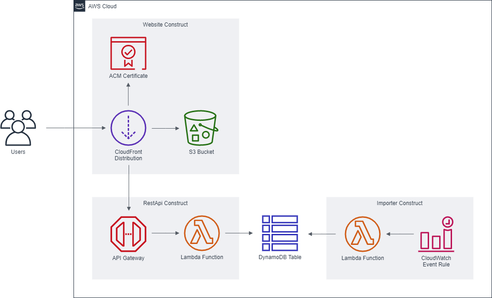

# Finance Dashboard

This project is indented to be used as a demo during virtual classrooms. It demonstrates concepts such as a serverless architecture, DynamoDB table design, and usage of the Cloud Development Kit.

## Architecture

This project uses Amazon CloudFront, Amazon S3, ACM, API Gateway, AWS Lambda, Amazon DynamoDB, and Amazon CloudWatch Event Rules.



## Serverless

One of the benefits of serverless is that you can run small (demo) website very cost effectively. These are the different pricing metrics for this application:

Metric | Cost | Unit
-|-:|:-
S3 TimedStorage-ByteHrs | $0.0245 | per GB-month
S3 Requests-Tier2 | $0.0043 | per 10,000 GET requests
CloudFront Requests-Tier2-HTTPS | $0.0120 | per 10,000 HTTPS requests
CloudFront Bandwith | $0.0850 | per GB
DynamoDB TimedStorage-ByteHrs | $0.3060 | per GB-month
DynamoDB PayPerRequestThroughput | $0.3050 | per 1M read requests
Lambda Lambda-GB-Second | $0.1667 | per 10,000 GB-second
Lambda Request | $0.2000 | per 1M requests
ApiGatewayRequest | $3.7000 | per 1M requests

For this calculation, let's assume the static website is 6 KB and the data in DynamoDB is 2.5 MB. And let's also assume that each visitor loads the static content once and makes 5 API requests on average (with each request transferring an average of 60 items, totaling 2 KB).

The total price of storage in S3 and DynamoDB is approximately **$0.0008 per month**. On top of that there is a price per request. The combined price for API Gateway, S3, CloudFront, DynamoDB and Data Transfer is approximately **$0.3347 per 10,000 visitors**. That means that this web application can serve one million visitors for less than $35 and anything less than 300 visitors is less than $0.01 and likely will be free.

\* All prices are based on `eu-central-1` and do not include the [AWS Free Tier](https://aws.amazon.com/free/)

\*\* Note: the demo uses provisioned concurrency, but this hasn't been included in the price calculation (yet).

## Live environment

A live environment can be found at [finance.demo.training](https://finance.demo.training).


## Setup

It is recommended to setup an CDK project in a Python virtual environment. This can easily be done with `venv`.

```sh
python3 -m venv .venv
```

To activate the virtual environment

```sh
source .venv/bin/activate
```

To install CDK libraries:

```sh
pip install -r cdk/requirements.txt
```

To deploy the CDK template:

```sh
cdk deploy
```
